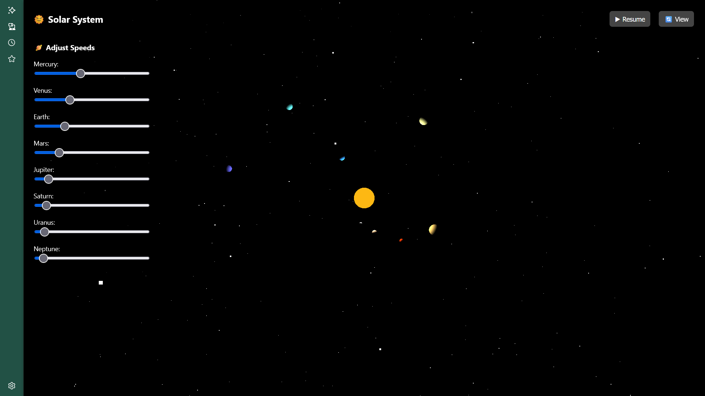
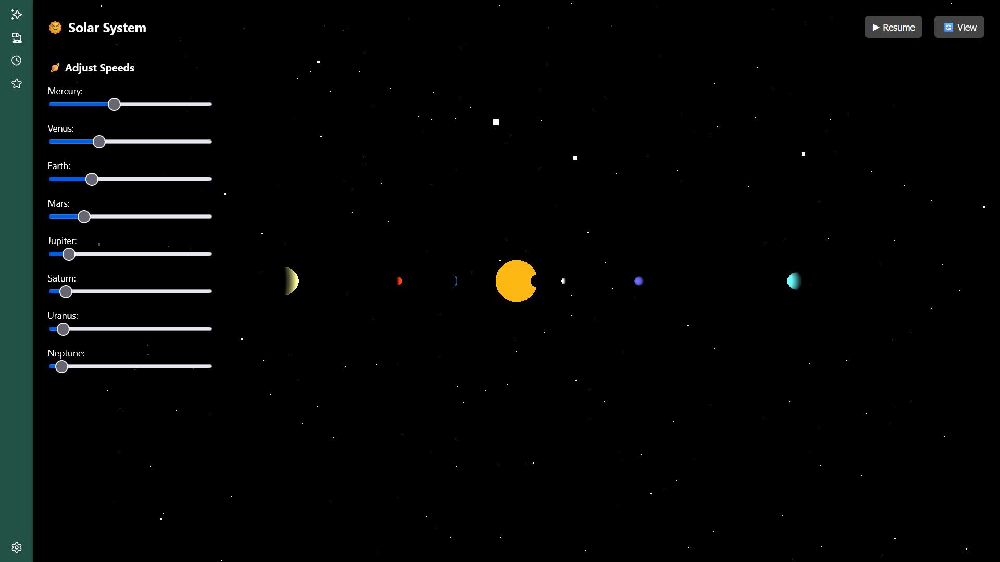
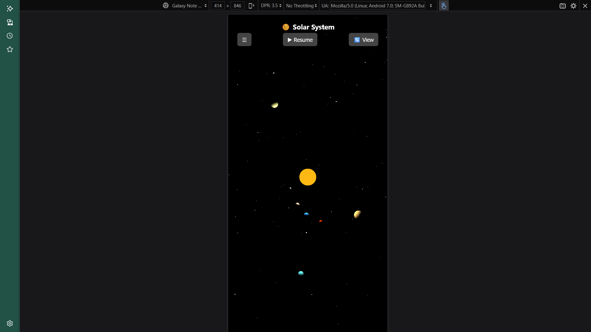
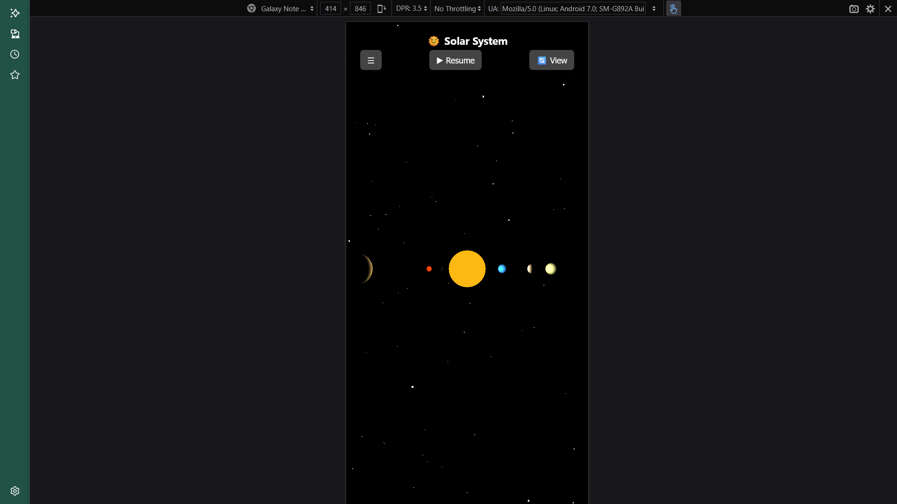

# 🌌 Solar System 3D Simulation

A mobile-responsive **3D simulation of the solar system** built using **Three.js** and pure JavaScript.  
This project demonstrates 3D rendering, animation, and real-time interactivity — including orbiting planets, speed control, and view toggling.

---

## 📸 Preview

  
  
  
  
<sup>Top-down and side views available — works on all modern browsers and mobile devices</sup>

---

## 🚀 Features

✅ **3D Solar System** – Sun at the center, 8 planets orbiting with realistic distances  
✅ **Smooth Animations** – Planets rotate around the Sun with independent speeds  
✅ **Speed Control Panel** – Adjust orbital speed of each planet in real-time  
✅ **Hamburger Menu** – Mobile-friendly toggle to access controls  
✅ **Pause/Resume** – Control the simulation with a button  
✅ **Top/Side View Toggle** – Switch between top and side camera perspectives  
✅ **Starry Background** – Adds visual depth to the scene  
✅ **Dark Mode by Default** – Maintains focus on simulation

---

## 🖥️ Desktop vs. 📱 Mobile View

| Feature          | Desktop                      | Mobile                         |
|------------------|-------------------------------|----------------------------------|
| Speed Controls   | Always visible on left panel | Toggleable via ☰ menu          |
| Camera View      | Toggle between top/side      | Works smoothly                 |
| Buttons Layout   | Inline                       | Stacked for narrow screens     |

---

## 🌐 Live Demo

👉 [**Click here to view the live simulation**](https://abhijith-s-2002.github.io/solar-system-animation/)  
<sub>Replace the above link with your actual hosted site URL</sub>

---

## 📦 How to Run the Code
 Open index.html in Your Browser
No build tools or server setup required.

Simply double-click on index.html
OR
➤ Using VS Code Live Server Extension:
Open the folder in Visual Studio Code

Install the Live Server extension

Right-click index.html → Open with Live Server


Right-click → “Open With” → your browser of choice
### 1. Clone or Download the Repository

```bash
git clone https://github.com/abhijith-s-2002/solar-system-animation

